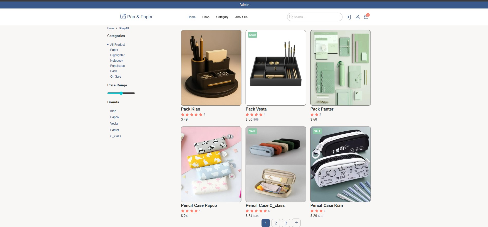

# 🖋️ Stationery Shop

[](https://python.org)
[](https://djangoproject.com)
[](LICENSE)

---

## 📌 Overview

**Stationery Shop** is my **first Django-based online store project**. It was developed as a **training exercise** to learn the fundamentals of web development with Django framework.

This project represents my initial steps into building e-commerce functionality. It's a learning playground where I explore Django's core concepts including models, views, templates, user authentication, and admin interface.

> ⚠️ **Note:** This is a **learning/practice project**, not a production-ready application.

## Shots

**HomePage**

<div align="center">
  
</div>

**Best Selers** 

<div align="center">
  
</div>

**ShopPage** 

<div align="center">
  
</div>

**LoginPage**

<div align="center">
  
</div>

---

## ✨ Current Features

- ✅ Product listing and display
- ✅ Product categories
- ✅ User registration and login (basic authentication)
- ✅ Admin panel for product management
- ✅ Responsive front-end (HTML/CSS/JS)
- ✅ Basic template structure

---

## 🚧 Work in Progress / Missing Features

As this is my first Django shop project, the following **key e-commerce features are NOT yet implemented** (planned for future learning):

- ❌ **Shopping cart** functionality
- ❌ **Payment gateway** integration
- ❌ **Comment/review** system for products
- ❌ Order processing workflow
- ❌ Wishlist feature
- ❌ Advanced search/filtering

These missing features highlight areas I'm actively learning and plan to implement in upcoming versions.

---

## 🛠️ Tech Stack

- **Backend:** Django (Python)
- **Frontend:** HTML5, CSS3, JavaScript
- **Database:** SQLite (development)
- **Version Control:** Git & GitHub

---

## 📂 Project Structure

Stationery-Shop/
├── accounts/ # User authentication app
├── shop/ # Main shop app (products, categories)
├── templates/ # HTML templates
├── statics/ # Static files (CSS, JS, images)
├── media/ # User-uploaded media
├── stationery_shop/ # Project settings
├── manage.py
├── db.sqlite3
├── requirement.txt
└── README.md

---


## 🚀 Getting Started

### Prerequisites

- Python 3.x installed
- Git (optional, for cloning)

### Installation

1. **Clone the repository**

    ```bash
    git clone https://github.com/Ali-Arezoomandi/Stationery-Shop.git
    cd Stationery-Shop

2. **Create and activate a virtual environment**

    # Windows
    python -m venv .venv
    .venv\Scripts\activate

    # macOS/Linux
    python3 -m venv .venv
    source .venv/bin/activate

3. **Install dependencies**

    pip install -r requirement.txt

4. **Run migrations**

    python manage.py migrate
    
5. **Start the development server**

    python manage.py runserver
    
6. **Open your browser and navigate to http://127.0.0.1:8000**

🎯 Purpose of This Project
This project was created to:
- Practice Django framework fundamentals
- Understand MTV (Model-Template-View) architecture
- Learn user authentication flows
- Build a functional (though incomplete) e-commerce frontend
- Establish good Git/GitHub practices

---

## 🤝 Contributing

As this is a personal learning project, I'm not actively seeking contributions. However, feel free to fork the repository and experiment on your own!

---

## ✍️ Author

Ali-Arezoomandi
📧 Contact: [ali.arezoomandi1723.email@example.com]
💻 GitHub: https://github.com/Ali-Arezoomandi

